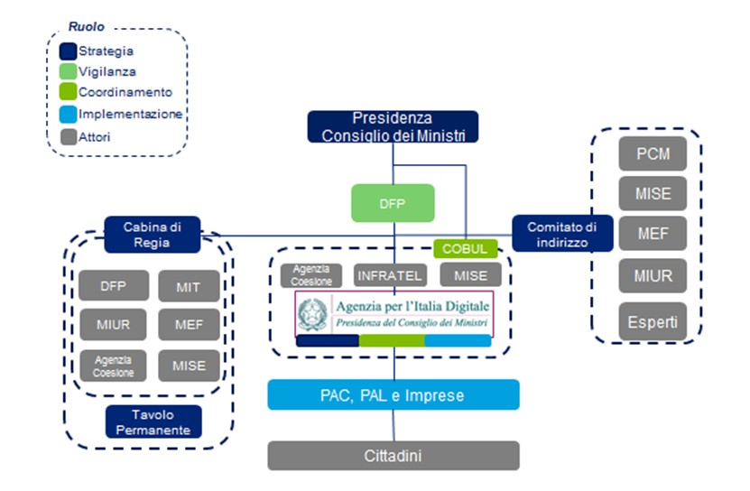

Organizzazione
^^^^^^^^^^^^^^

Il Governo ha operato recentemente interventi di semplificazione
della governance dell'Agenda Digitale Italiana (ADI), al fine di
assicurarne una maggiore efficacia. Ulteriori semplificazioni
saranno realizzate in sede di attuazione della Legge 7 agosto 2015,
n. 124 “Deleghe al Governo in materia di riorganizzazione delle
amministrazioni pubbliche” (GU Serie Generale n.187 del 13/08/2015).

La titolarità della responsabilità dell'Agenda Digitale Italiana è
del massimo livello politico, il Presidente del Consiglio dei
Ministri, anche attraverso il proprio Consigliere all'Innovazione,
che la condivide con il Ministro per la semplificazione e la
pubblica amministrazione, sulla base di espressa delega.

Al Ministro per la semplificazione e la pubblica amministrazione è
assegnata la vigilanza sull'Agenzia per l'Italia Digitale, che è
chiamata ad assicurare il conseguimento degli obiettivi dell'Agenda
Digitale Italiana, anche attraverso il coordinamento delle
amministrazioni centrali e locali.

AgID assicura la necessaria integrazione fra la strategia nazionale
e i piani operativi regionali per evitare l'eccessiva frammentazione
degli interventi

sperimentata in passato. Una grande opportunità capace di sfruttare
sinergie e razionalizzare le risorse impiegate.

L'Agenzia è quindi il braccio operativo della Presidenza del
Consiglio dei Ministri che, ai sensi della legge istitutiva (L.n.
134/12) coordina l'attuazione della presente strategia e ha la
responsabilità di assicurare sotto il profilo dell'efficacia ed
economicità il raggiungimento complessivo degli obiettivi, anche
monitorando l'attuazione di tutti i piani avviati per la
digitalizzazione del Paese.

Riguardo la verifica ex ante delle iniziative e dei progetti ICT
della PA è prevista la predisposizione da parte di AgID di un piano
triennale comprensivo delle relative fonti di finanziamento
associate, che sarà sottoposto all’ approvazione del Presidente del
Consiglio dei Ministri. Il piano degli acquisti verrà invece
centralizzato su Consip e sui soggetti aggregatori (es. centrali
d’acquisto regionali) e dovrà essere coerente con quanto previsto
nella pianificazione triennale.

L’Agenzia stessa mediante un processo di verifica ex post assicurerà
sia un monitoraggio puntuale dello stato di avanzamento dei progetti
e del raggiungimento dei risultati prefissati dalle Amministrazioni
nel piano triennale che eventuali interventi correttivi.

   
   La governance centrale

Ai fini dell'attuazione della strategia assumono un ruolo di
rilievo, fra gli altri:

-  il **Ministero dello Sviluppo Economico** per quanto concerne la
   strategia nazionale per la banda ultralarga, i programmi per la
   competitività delle imprese e gli interventi sulle Smart Cities;

-  il **Dipartimento della Funzione Pubblica** relativamente alle
   iniziative di digitalizzazione della Pubblica Amministrazione;

-  il **Dipartimento per gli affari regionali e le autonomie,** insieme
   alla **Conferenze Stato Regioni ed Unificata** per il coordinamento
   del territorio;

-  il **Ministero della Salute** relativamente alle iniziative di
   e-health contenute nel «Patto per la Salute»;

-  il **Ministero dell'Istruzione, della Università e della Ricerca**
   per le iniziative sul sistema scolastico e universitario, nonché per
   la citata smart specialization;

-  il **Ministero dell'Economia e della Finanza** per quanto concerne la
   centralizzazione della programmazione e della spesa, nonché per la
   collaborazione operativa delle proprie società in house SOGEI e
   CONSIP;

-  il **Ministero della Giustizia** sia relativamente alle iniziative
   per il «processo telematico», sia più in generale per la
   digitalizzazione del settore «giustizia»;

-  il **Ministero delle Politiche Agricole Alimentari e Forestali,** per
   lo sviluppo delle aree rurali attraverso il digitale, considerando
   che anche il Fondo Europeo Agricolo per lo Sviluppo Rurale concorre a
   finanziare la presente strategia;

-  **L'Agenzia per la Coesione** considerata la natura dei finanziamenti
   della presente strategia, eserciterà i suoi poteri di coordinamento e
   controllo della spesa valutando e indirizzando i piani regionali,
   nonché monitorando l'attuazione della misura e analizzando i dati
   pubblicati dal Ministero dello sviluppo economico;

-  la **Banca d'Italia** per le iniziative sulla digitalizzazione dei
   pagamenti;

-  **ANCI** per quanto riguarda il coordinamento dei comuni con
   specifico riferimento al programma smart cities and communities.

Le **Regioni e le Province Autonome** hanno competenza diretta in
materia e gestiscono le risorse destinate al finanziamento della
strategia, realizzando anche autonomamente i piani.

È evidente, in ogni caso, che l'Obiettivo Tematico Agenda Digitale è per
sua natura trasversale e avrà bisogno quindi di grande coordinamento e
visione unitaria con **tutte le amministrazioni centrali e locali**
nella sua attuazione.

Nel passato il coordinamento fra Amministrazioni centrali e locali è
stato inadeguato, con risultati da migliorare sia sotto il profilo
dell'economicità sia della qualità e tasso di utilizzo di prodotti e
servizi realizzati.

L'Agenzia per l'Italia digitale vuole, dunque, promuovere un nuovo e
mutato rapporto tra le amministrazioni centrali e quelle locali,
basato su una **cooperazione orizzontale virtuosa,** fondata sulla
co-progettazione dei servizi per definire standard comuni, anche
partendo dalle migliori pratiche.

La cooperazione fra le Amministrazioni consentirà di valorizzare le
risorse e le professionalità già al servizio delle amministrazioni
sui territori per completare il processo di digitalizzazione del
Paese.

Proprio in tale prospettiva la Strategia per la Crescita digitale,
come quella per la Banda Ultra Larga, è stata oggetto di un ampio
confronto con le Regioni e le Province Autonome di Trento e Bolzano,
promosso ed organizzato da AgID a partire da novembre 2014 e per
tutto il 2015, tramite incontri con i rappresentanti delle strutture
competenti per la programmazione e gestione dei fondi strutturali e
di quelle preposte alla definizione ed attuazione delle agende
digitali.

Per la verifica di coerenza sono state illustrate e motivate le
scelte effettuate dalle Regioni nei PO progressivamente approvati e
condivise le azioni complementari su fondi ordinari pianificate o da
mettere in campo per la convergenza sugli indirizzi ed obiettivi
nazionali; sono stati presi reciproci impegni di cooperazione e
co-progettazione finalizzati ad aggiornare in itinere i PO per
l’allineamento alle strategie nazionali.

Per garantire il presidio della strategia e la coerenza con i
processi di riforma, come previsto dall’Accordo di Partenariato, è
stato istituito il Comitato di Pilotaggio per il coordinamento degli
interventi OT11 e OT2, incardinato presso il Dipartimento della
Funzione Pubblica, di cui fanno parte, oltre ai rappresentanti delle
Amministrazioni centrali responsabili della gestione dei Programmi
Operativi e di quelle che coordinano i Fondi strutturali, la
Commissione europea (DG Politica regionale e urbana e DG
Occupazione, affari sociali e inclusione), tre rappresentanti
regionali (Lombardia, Sardegna, Sicilia) e l’AgID.

L’Agenzia sta inoltre promuovendo azioni che concorrono al
coordinamento e al supporto delle Regioni e degli Enti locali, in
particolare nella fase di progettazione e attuazione degli
interventi, come, ad esempio, la creazione di Unità di progetto
territoriali, intese come strumento per il conseguimento degli
obiettivi programmatici dell’ente, in primis la promozione ed
attuazione dell’Agenda digitale italiana: a partire dal 2014
l’Agenzia ha infatti sottoscritto diverse convenzioni con i soggetti
territoriali ed ha reso operative le prime tre Unità.

Un ulteriore strumento di cooperazione inter-istituzionale attivato
è rappresentato dal Protocollo d’intesa sottoscritto a marzo 2015
dalle Regioni del Centro-Italia e da AgID, con la finalità di
attuare le iniziative dell’Agenda digitale nell’ambito della
programmazione 2014-2020 con un percorso collaborativo che, in
particolare, definisce tra le parti impegni condivisi per
l’attuazione di azioni interregionali di sistema, individua e
sviluppa soluzioni e prassi comuni, monitora i risultati ottenuti
per la Crescita digitale.

Analoghi accordi e intese saranno stipulati per il coordinamento in
aree territoriali omogenee e/o per il conseguimento di obiettivi
specifici legati alle singole linee previste dalla Strategia per la
Crescita digitale.

Come per i precedenti periodi di programmazione, saranno utilizzati
gli Accordi di Programma Quadro, quali strumenti attuativi della
programmazione che garantiscono la convergenza delle risorse di
settore provenienti da fonti finanziarie diverse (ordinarie,
aggiuntive; regionali, nazionali, comunitarie, ecc.) su iniziative
condivise, assicurando la complementarietà delle azioni e il
monitoraggio e la verifica sull’attuazione e sui risultati
conseguiti.

Si consideri infine che il Comitato di Indirizzo di AgID è l'organo
di indirizzo strategico ed è composto da rappresentanti dei vari
livelli istituzionali (PAC e Regioni): presieduto dal rappresentante
della Presidenza del Consiglio dei Ministri, il Comitato delibera,
in particolare, sul modello strategico di evoluzione del Sistema
Informativo della Pubblica Amministrazione, individuandone le
priorità di intervento anche sulla base delle disponibilità
finanziarie, e ne monitora l'attuazione.

La collaborazione deve estendersi anche al settore privato e civico. Le
**associazioni di categoria insieme a tutti gli stakeholders** sono
chiamate a contribuire anche attraverso azioni di sostegno endogene, ad
esempio "adottando un'impresa per il Digitale", ovvero attraverso una
contaminazione all'uso degli strumenti fra le realtà più progredite
tecnologicamente e le più arretrate, affinché le più avanzate possano
aiutare soprattutto le PMI a conoscere e utilizzare al meglio le
opportunità offerte dal digitale.

In questo quadro, il **Digital Champion** contribuirà alla
disseminazione e divulgazione dei risultati, nonché alle attività di
comunicazione pubblica a supporto.

Le criticità nell’attuazione delle misure ICT nell’ambito dei Fondi
strutturali che interessa l’intera PA (Ministeri e Regioni) sono state
riconosciute nel più ampio quadro della strutturale difficoltà nella
spesa dei fondi UE ed una diffusa inadeguatezza a realizzare politiche
pubbliche in modo efficace e tempestivo a causa di un eccessivo carico
burocratico e legislativo.

L’impegno di miglioramento di questa situazione si è concretizzato,
nell’ambito del ciclo di programmazione 2014-2020, in un’azione diretta
rappresentata dal Piano di Rafforzamento Amministrativo (PRA), che si
configura come principale strumento a servizio delle Amministrazioni per
migliorare la gestione delle proprie politiche e per avviare in modo
coordinato una riforma della gestione dei fondi strutturali. I PRA sono
inoltre riconosciuti dalla Commissione Europea come uno strumento per
attuare la strategia di miglioramento amministrativo, organizzativo e
tecnico per aumentare l’efficacia nell’attuazione dei programmi
cofinanziati dai Fondi strutturali

I PRA sono definiti dalle Amministrazioni titolari dei programmi
operativi 2014-2020, cioè le Autorità di Gestione, di concerto con gli
Organismi intermedi.

Per la redazione dei PRA le Amministrazioni sono state supportate dalle
Linee guida condivise con la Commissione europea e trasmesse dal
Dipartimento per lo sviluppo e la Coesione economica alle Autorità di
gestione dei programmi operativi 2014-2020 l’11 luglio 2014.

Il PRA parte dall’analisi dell’esperienza passata e dei principali
problemi di varia natura verificatisi nell’attuazione della
programmazione 2007-2013 riguardo alle principali tipologie di spesa,
quantificandone gli effetti, definendone l’origine e la natura e propone
dei significativi correttivi sul piano legislativo, procedurale ed
organizzativo, che portino a precisi risultati quantificati e
verificabili. Esso mira ad identificare le misure di semplificazione e
di razionalizzazione del processo di decisione pubblica volto alla
tempestiva ed efficace attuazione dei Programmi operativi.

Con tale strumento le Regioni e le Province Autonome e le
Amministrazioni centrali, pur differenziandosi nel contesto territoriale
e legislativo in cui operano, per la soluzione delle diverse criticità
nell’attuazione delle misure nell’ambito dei Fondi strutturali, hanno
individuato obiettivi di miglioramento e tre diverse aree di intervento
comuni:

1. interventi di semplificazione legislative e procedurali, destinati a
   ridurre tempi, sforzo lavorativo e i costi, laddove esse comportino
   reiterazioni e sovrapposizioni e ridondanza di adempimenti, al fine
   di rendere più rapido e trasparente l’iter di preparazione e
   realizzazione degli interventi. In particolare alcuni interventi si
   pongono come obiettivo l’abbattimento dei costi burocratici
   attraverso l’attuazione di provvedimenti finalizzati alla
   smaterializzazione e digitalizzazione delle procedure amministrative.
   Si tratta in questo caso anche dell’attuazione del “Codice
   dell'amministrazione digitale”, come pure di un utilizzo più
   intensivo della firma elettronica, della modulistica elettronica,
   della corrispondenza elettronica, della posta elettronica certificata
   (PEC) e l’adozione di workflow specifici, che permettano lo
   svolgimento online dei procedimenti amministrativi.

2. interventi sul personale dell’Amministrazione coinvolto
   nell’attuazione dei Programmi finanziati dai Fondi SIE 2014-2020 che
   necessitano sia un adeguamento delle competenze interne di alto
   profilo sia qualitative che quantitative per la gestione
   amministrativa, sia un risparmio di personale amministrativo legato
   alla contemporanea semplificazione e riduzione di steps procedurali
   sia in termini di quantità del personale e della qualità e
   appropriatezza delle sue competenze tecniche, sia in termini di una
   opportuna collocazione del personale nella struttura organizzativa
   dell’Amministrazione e di una revisione delle modalità e degli
   strumenti di lavoro. L’adeguamento delle dotazioni organiche delle
   strutture impegnate nella programmazione comunitaria 2014-2020 è
   raggiunto, per esempio, attraverso azioni di riorganizzazione
   interna, intensificazione delle attività formative (che possano
   garantire l’aggiornamento, l’implementazione e l’acquisizione di
   competenze altamente specializzate) e selezione di nuovo personale
   attraverso procedure selettive pubbliche;

3. Interventi tesi a rafforzare le funzioni trasversali e gli strumenti
   comuni alle amministrazioni che permettono una migliore e comune
   utilizzazione degli strumenti informatici e telematici, migliori
   capacità di comunicazione e taglio dei tempi di lavoro in comune e
   condiviso.

Gli interventi su cui si stanno impegnando le amministrazioni sono in
molti casi:

-  una maggiore informatizzazione delle procedure;

-  un maggior utilizzo della trasmissione telematica dei dati tra
   amministrazione e beneficiari con progressiva eliminazione del
   supporto cartaceo;

-  l’estensione dell’utilizzo di modulistica standard e di procedure
   informatizzate alle nuove strutture attuatrici coinvolte nella
   realizzazione del POR FSE 2014-2020;

-  trasparenza e informazione delle azioni collegate al PO e del loro
   progressivo stato di avanzamento.

È da rilevare che dall’esame dei PRA delle Regioni e Province Autonome e
delle Amministrazioni centrali - la cui redazione e approvazione, nella
maggior parte dei casi, è stata precedente alla pubblicazione della
Strategia per la Crescita Digitale 2014-2020 - emerge la presenza di
interventi convergenti con le azioni ivi descritte. In sintesi, sono
oltre trenta gli interventi tra quelli individuati dalle Amministrazioni
come strumento di rafforzamento amministrativo che maggiormente si
allineano con gran parte delle azioni di Crescita Digitale, in
particolare è data rilevanza alle azioni convergenti sull’azione
“Razionalizzazione del patrimonio ICT”.

Da quanto evidenziato, si considera quindi l’opportunità del prossimo
aggiornamento previsto per i PRA per focalizzare maggiormente le azioni
da intraprendere al fine di incidere puntualmente sulle criticità
nell’attuazione delle misure ICT programmate nei Programmi Operativi
2014–2020.